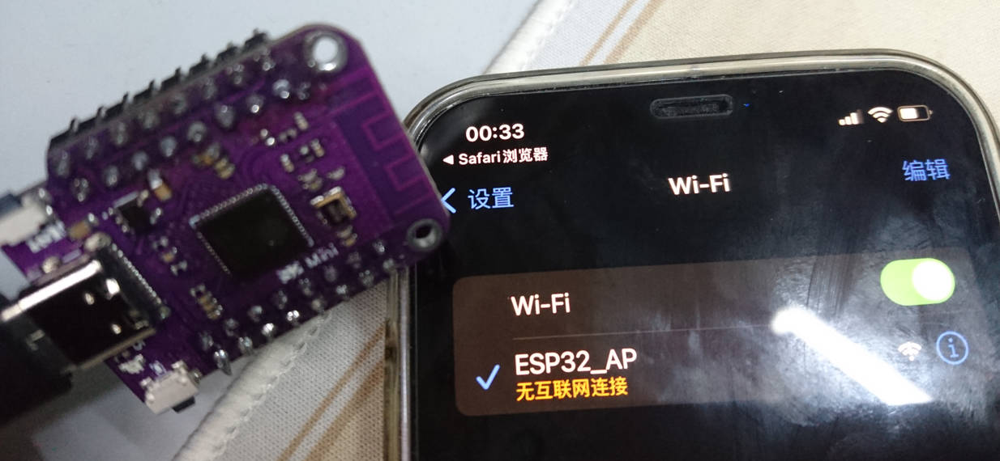
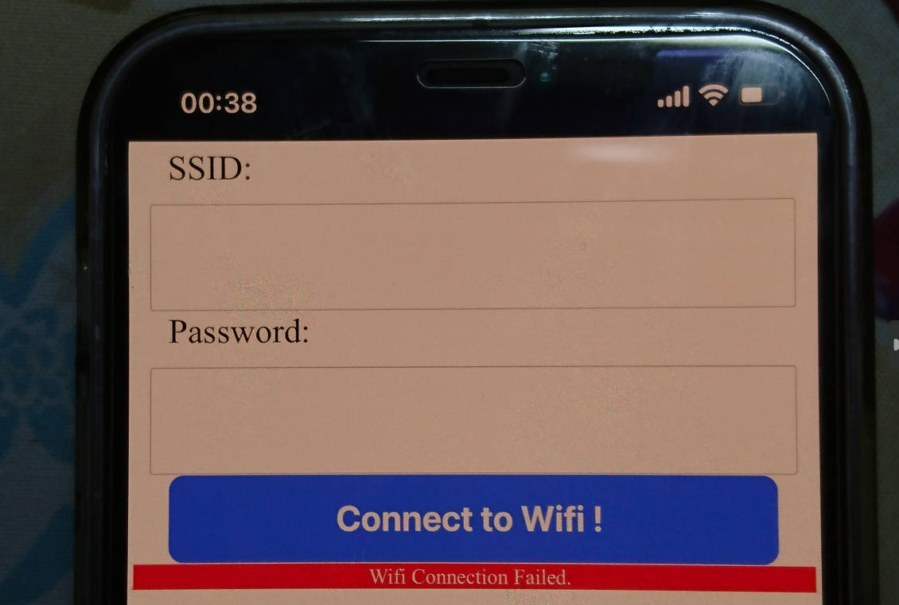

### 基于microdot，输入ssid和密码并连接wifi的程序。
microdot是一个webserver：https://github.com/miguelgrinberg/microdot  
microdot.py fork自microdot

+ 手机/电脑wifi连接esp的ap：ESP32_AP
+ 浏览器打开对应ip（可能是192.168.4.1）
+ 输入ssid和密码
+ 点击连接  
如果失败，会自动返回并弹出红色提示。  
如果成功，ap断开，浏览器不会收到提示。

  
